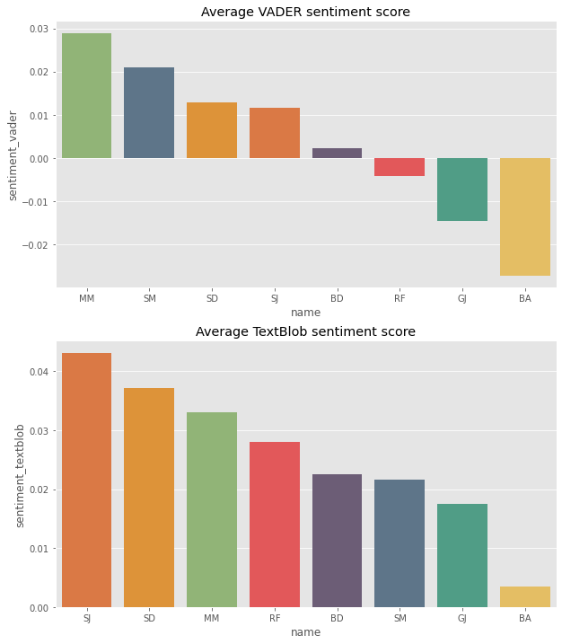

```python
import pandas as pd
from tqdm.notebook import tqdm_notebook
from dateutil import parser
import seaborn as sns
import matplotlib.pyplot as plt
import datetime
import numpy as np
from profanity_check import predict, predict_prob
import warnings
import nltk
from nltk.sentiment.vader import SentimentIntensityAnalyzer
nltk.download('vader_lexicon')
from textblob import TextBlob
import emoji
import itertools 
import matplotlib.style as style
from google.colab import files
style.use('ggplot')
warnings.filterwarnings('ignore')
```

# Preprocessing


```python
def valid_user(str):
  if len(str.split(' ')) < 5 and not 'left' in str and not 'added' in str and not 'removed' in str:
    return True
  elif '+91' in str and len(str.split(' ')) <= 3:
    return True
  return False
```


```python
def vali_date(text):
    try:
        datetime.datetime.strptime(text, '%m/%d/%y')
        return True
    except Exception as e:
      return False

lines = []
with open('WhatsApp Chat with The Boys.txt') as f:
  for line in f:
    if vali_date(line.split(',')[0]):
      lines.append(line.strip('\n'))
    else:
      lines[len(lines) - 1] += ' ' + line.strip('\n')
  
datetimes, names, msgs = ([] for i in range(3))
for line in tqdm_notebook(lines, total = len(lines), unit = 'line'):
    datetimes.append(datetime.datetime.strptime(line.split('-')[0], '%m/%d/%y, %I:%M %p '))
    names.append(line.split('-')[1].split(':')[0].strip())
    msgs.append(''.join(line.split('-')[1].split(':')[1:]))

df = pd.DataFrame()
df['datetime'] = datetimes
df['name'] = names
df['msg'] = msgs

'''
The file  had lines for when the group names were changed, and when people left or were removed. 
I will remove these since they are of no use. One more friend changed his number, and to include that, 
I had to do a little bit more filtering. 
'''

def valid_user(str):
  if len(str.split(' ')) < 5 and not 'left' in str and not 'added' in str and not 'removed' in str and not 'admin' in str:
    return True
  elif '+91' in str and len(str.split(' ')) <= 3:
    return True
  return False


df = df[df['name'].apply(valid_user)]
df.loc[(df.name == '<redacted>'), 'name'] = 'MM' 
df.loc[(df.name == '<redacted>'), 'name'] = 'MM' 
df.loc[(df.name == '<redacted>'), 'name'] = 'SD' 
df.loc[(df.name == '<redacted>'), 'name'] = 'BA'
df.loc[(df.name == '<redacted>'), 'name'] = 'RF'
df.loc[(df.name == '<redacted>'), 'name'] = 'SJ'
df.loc[(df.name == '<redacted>'), 'name'] = 'GJ'
df.loc[(df.name == '<redacted>'), 'name'] = 'BD'
df.loc[(df.name == '<redacted>'), 'name'] = 'SM'
df = df[df['name'] != '<redacted>']
df['name'].unique()

df['date'] = df['datetime'].apply(lambda x: x.date())
df['day_sent'] = df['datetime'].dt.strftime('%a')
df['month_sent'] = df['datetime'].dt.strftime('%b')
df['year_sent'] = df['datetime'].dt.year
df['count'] = 1 # To groupby days and have a count of how many messages were sent per day
df = df[~df['msg'].apply(lambda x: True if '\xa0' in x else False)] # To remove characters with '\xa0'
print(df.shape)
```


    HBox(children=(FloatProgress(value=0.0, max=39502.0), HTML(value='')))


    
    (39176, 8)
    


```python
def vali_date(text):
    try:
        datetime.datetime.strptime(text, '%d/%m/%y')
        return True
    except Exception as e:
      return False

lines = []
with open('Whatsapp Chat with The Boys Old.txt') as f:
  for line in f:
    if vali_date(line.split(',')[0]):
      lines.append(line.strip('\n'))
    else:
      lines[len(lines) - 1] += ' ' + line.strip('\n')
  
datetimes, names, msgs = ([] for i in range(3))
for line in tqdm_notebook(lines, total = len(lines), unit = 'line'):
    datetimes.append(datetime.datetime.strptime(line.split('-')[0], '%d/%m/%y, %I:%M %p '))
    names.append(line.split('-')[1].split(':')[0].strip())
    msgs.append(''.join(line.split('-')[1].split(':')[1:]))

df2 = pd.DataFrame()
df2['datetime'] = datetimes
df2['name'] = names
df2['msg'] = msgs


df2 = df2[df2['name'].apply(valid_user)]
df2.loc[(df2.name == '<redacted>'), 'name'] = 'MM' 
df2.loc[(df2.name == '<redacted>'), 'name'] = 'SD' 
df2.loc[(df2.name == '<redacted>'), 'name'] = 'BA'
df2.loc[(df2.name == '<redacted>'), 'name'] = 'RF'
df2.loc[(df2.name == '<redacted>'), 'name'] = 'SJ'
df2.loc[(df2.name == '<redacted>'), 'name'] = 'GJ'
df2.loc[(df2.name == '<redacted>'), 'name'] = 'BD'
df2.loc[(df2.name == '<redacted>'), 'name'] = 'SM'
df2 = df2[df2['name'] != '<redacted>']
df2['name'].unique()

df2['day_sent'] = df2['datetime'].dt.strftime('%a')
df2['month_sent'] = df2['datetime'].dt.strftime('%b')
df2['year_sent'] = df2['datetime'].dt.year
df2['date'] = df2['datetime'].apply(lambda x: x.date())
df2['count'] = 1 # To groupby days and have a count of how many messages were sent per day
df2 = df2[~df2['msg'].apply(lambda x: True if '\xa0' in x else False)] # To remove characters with '\xa0'
print(df2.shape)
```


    HBox(children=(FloatProgress(value=0.0, max=70459.0), HTML(value='')))


    
    (68584, 8)
    


```python
df = pd.concat([df, df2]).drop_duplicates().reset_index(drop = True)
df = df.sort_values(by = 'datetime')
print(df.shape)
df.head()
```

    (74357, 8)
    


<div>
<style scoped>
    .dataframe tbody tr th:only-of-type {
        vertical-align: middle;
    }

    .dataframe tbody tr th {
        vertical-align: top;
    }

    .dataframe thead th {
        text-align: right;
    }
</style>
<table border="1" class="dataframe">
  <thead>
    <tr style="text-align: right;">
      <th></th>
      <th>datetime</th>
      <th>name</th>
      <th>msg</th>
      <th>date</th>
      <th>day_sent</th>
      <th>month_sent</th>
      <th>year_sent</th>
      <th>count</th>
    </tr>
  </thead>
  <tbody>
    <tr>
      <th>38363</th>
      <td>2017-09-05 21:16:00</td>
      <td>RF</td>
      <td>Welcome to the new group. I'm gonna get strai...</td>
      <td>2017-09-05</td>
      <td>Tue</td>
      <td>Sep</td>
      <td>2017</td>
      <td>1</td>
    </tr>
    <tr>
      <th>38364</th>
      <td>2017-09-05 21:17:00</td>
      <td>SJ</td>
      <td>K</td>
      <td>2017-09-05</td>
      <td>Tue</td>
      <td>Sep</td>
      <td>2017</td>
      <td>1</td>
    </tr>
    <tr>
      <th>38365</th>
      <td>2017-09-05 21:25:00</td>
      <td>SD</td>
      <td>Hi all. Good to see you guys again.</td>
      <td>2017-09-05</td>
      <td>Tue</td>
      <td>Sep</td>
      <td>2017</td>
      <td>1</td>
    </tr>
    <tr>
      <th>38366</th>
      <td>2017-09-05 21:26:00</td>
      <td>RF</td>
      <td>&lt;Media omitted&gt;</td>
      <td>2017-09-05</td>
      <td>Tue</td>
      <td>Sep</td>
      <td>2017</td>
      <td>1</td>
    </tr>
    <tr>
      <th>38367</th>
      <td>2017-09-05 21:29:00</td>
      <td>BA</td>
      <td>Doubt Why is a pizza circle, cut into a trian...</td>
      <td>2017-09-05</td>
      <td>Tue</td>
      <td>Sep</td>
      <td>2017</td>
      <td>1</td>
    </tr>
  </tbody>
</table>
</div>


```python
grouped_by_date = df.groupby('date').sum().reset_index()

plt.figure(figsize = (27, 6))
sns.lineplot(x = 'date', y = 'count', data = grouped_by_date)
plt.title('Messages sent per day over a time period')

#plt.savefig('lineplot_full.svg', format = 'svg')
#files.download('lineplot_full.svg')
```


    Text(0.5, 1.0, 'Messages sent per day over a time period')


# Exploratory Data Analysis

I'm defining the following function to main consistent colors for each person across all plots. Since the order will vary depending on the plot, this is passed to the function which will reorder colors in a particular order so that the color of a certain person remains the same no matter the plot. This will help maintain consistency and readability amongst the many graphs I will be plotting. 

I could've used seaborn's color palette but wanted to try some different colors so I grabbed them from https://coolors.co/


```python
def get_colors_of_certain_order(names_in_certain_order):
  order = list(names_in_certain_order)
  return_list = []
  for name in order:
    return_list.append(color_dict[name])
  return return_list

color_dict = {}
colors = ['#F94144', '#F3722C', '#F8961E', '#F9C74F', '#90BE6D', '#43AA8B', '#577590', '#6D597A']
sns.palplot(colors)
names = df['name'].unique()

for name, color in zip(names, colors):
  color_dict[name] = color

color_dict
```


    {'BA': '#F9C74F',
     'BD': '#6D597A',
     'GJ': '#43AA8B',
     'MM': '#90BE6D',
     'RF': '#F94144',
     'SD': '#F8961E',
     'SJ': '#F3722C',
     'SM': '#577590'}


```python
fig, axs = plt.subplots(ncols = 2, figsize = (16, 6))

# Plot 1 - Countplot of total messages sent
sns.countplot(x = 'name', data = df, order = df['name'].value_counts().index, ax = axs[0], palette = get_colors_of_certain_order(df['name'].value_counts().index))
axs[0].set_title('Total Messages Sent')

# Plot 2 - Barplot of average message lengths
df['msg_length'] = df['msg'].apply(lambda x: len(x))
avg_msg_lengths = df.groupby('name').mean().reset_index().sort_values(by = 'msg_length', ascending = False)
sns.barplot(x = 'name', y = 'msg_length', data = avg_msg_lengths, ax = axs[1], palette = get_colors_of_certain_order(avg_msg_lengths['name']))
axs[1].set_title('Average Message Lengths')

#plt.savefig('msg_plots.svg', format = 'svg')
#files.download('msg_plots.svg')
```


    Text(0.5, 1.0, 'Average Message Lengths')


```python
df[df['name'] == 'RF'].sort_values(by = 'msg_length', ascending = False).head(4)
```


<div>
<style scoped>
    .dataframe tbody tr th:only-of-type {
        vertical-align: middle;
    }

    .dataframe tbody tr th {
        vertical-align: top;
    }

    .dataframe thead th {
        text-align: right;
    }
</style>
<table border="1" class="dataframe">
  <thead>
    <tr style="text-align: right;">
      <th></th>
      <th>datetime</th>
      <th>name</th>
      <th>msg</th>
      <th>date</th>
      <th>day_sent</th>
      <th>month_sent</th>
      <th>year_sent</th>
      <th>count</th>
      <th>msg_length</th>
    </tr>
  </thead>
  <tbody>
    <tr>
      <th>51922</th>
      <td>2017-12-18 17:33:00</td>
      <td>RF</td>
      <td>BASIS BASIS BASIS BASIS BASIS BASIS BASIS BAS...</td>
      <td>2017-12-18</td>
      <td>Mon</td>
      <td>Dec</td>
      <td>2017</td>
      <td>1</td>
      <td>58608</td>
    </tr>
    <tr>
      <th>51927</th>
      <td>2017-12-18 17:34:00</td>
      <td>RF</td>
      <td>BASIS BASIS BASIS BASIS BASIS BASIS BASIS BAS...</td>
      <td>2017-12-18</td>
      <td>Mon</td>
      <td>Dec</td>
      <td>2017</td>
      <td>1</td>
      <td>58608</td>
    </tr>
    <tr>
      <th>51932</th>
      <td>2017-12-18 17:35:00</td>
      <td>RF</td>
      <td>BASIS BASIS BASIS BASIS BASIS BASIS BASIS BAS...</td>
      <td>2017-12-18</td>
      <td>Mon</td>
      <td>Dec</td>
      <td>2017</td>
      <td>1</td>
      <td>58608</td>
    </tr>
    <tr>
      <th>51919</th>
      <td>2017-12-18 17:33:00</td>
      <td>RF</td>
      <td>BASISBASISBASISBASISBASISBASISBASISBASISBASIS...</td>
      <td>2017-12-18</td>
      <td>Mon</td>
      <td>Dec</td>
      <td>2017</td>
      <td>1</td>
      <td>4561</td>
    </tr>
  </tbody>
</table>
</div>


```python
# Plot 3 - Barplot of total media count
plt.figure(figsize = (8, 6))
df['is_media'] = df['msg'].apply(lambda x: 1 if '<Media omitted>' in x else 0)
df.groupby('name').sum().reset_index().sort_values(by = 'is_media', ascending = False)[['name', 'is_media']]
total_media_count = df.groupby('name').sum().reset_index().sort_values(by = 'is_media', ascending = False)[['name', 'is_media']]
sns.barplot(x = 'name', y = 'is_media', data = total_media_count, palette = get_colors_of_certain_order(total_media_count['name']))
plt.title('Total Media Sent')

#plt.savefig('total_media_plot.svg', format = 'svg')
#files.download('total_media_plot.svg')
```


    Text(0.5, 1.0, 'Total Media Sent')


What's the most used word for each person?


```python
word_dict = dict.fromkeys(df['name'].unique())
for key in word_dict.keys():
  word_dict[key] = {}

for name, msg in zip(df['name'], df['msg']):
  for word in msg.split():
    # If word contains the 'media ommited' message ignore
    if word not in ['<Media', 'omitted>']: 
      if word in word_dict[name]:
        word_dict[name][word] += 1
      else:
        word_dict[name][word] = 1

# Sorting emoji dictionary in descending order of word frequency
for name in df['name'].unique():
  word_dict[name] = {k: v for k, v in sorted(word_dict[name].items(), key = lambda item: item[1], reverse = True)}

grouped_df = df.groupby('name').sum().reset_index()
grouped_df['most_used_words'] = grouped_df['name'].apply(lambda x: word_dict[x])
grouped_df[['name', 'most_used_words']]
```


<div>
<style scoped>
    .dataframe tbody tr th:only-of-type {
        vertical-align: middle;
    }

    .dataframe tbody tr th {
        vertical-align: top;
    }

    .dataframe thead th {
        text-align: right;
    }
</style>
<table border="1" class="dataframe">
  <thead>
    <tr style="text-align: right;">
      <th></th>
      <th>name</th>
      <th>most_used_words</th>
    </tr>
  </thead>
  <tbody>
    <tr>
      <th>0</th>
      <td>BA</td>
      <td>{'oh': 2552, 'nooooo': 2480, 'the': 1795, 'i':...</td>
    </tr>
    <tr>
      <th>1</th>
      <td>BD</td>
      <td>{'the': 318, 'I': 262, 'is': 261, 'to': 237, '...</td>
    </tr>
    <tr>
      <th>2</th>
      <td>GJ</td>
      <td>{'the': 708, 'is': 680, 'I': 585, 'in': 570, '...</td>
    </tr>
    <tr>
      <th>3</th>
      <td>MM</td>
      <td>{'..': 1566, 'and': 476, 'to': 414, 'the': 401...</td>
    </tr>
    <tr>
      <th>4</th>
      <td>RF</td>
      <td>{'BASIS': 29306, 'the': 1051, 'I': 1003, 'to':...</td>
    </tr>
    <tr>
      <th>5</th>
      <td>SD</td>
      <td>{'the': 1008, 'to': 664, 'and': 561, 'a': 509,...</td>
    </tr>
    <tr>
      <th>6</th>
      <td>SJ</td>
      <td>{'the': 1485, 'is': 1288, 'a': 1042, 'to': 952...</td>
    </tr>
    <tr>
      <th>7</th>
      <td>SM</td>
      <td>{'I': 353, 'Yeah': 294, 'the': 261, 'is': 250,...</td>
    </tr>
  </tbody>
</table>
</div>


```python
fig, axs = plt.subplots(ncols = 2, figsize = (24, 6))

months = ['Jan', 'Feb', 'Mar', 'Apr', 'May', 'Jun', 'Jul', 'Aug', 'Sep', 'Oct', 'Nov', 'Dec']
grouped_by_month = df.groupby('month_sent').sum().reset_index().sort_values(by = 'count', ascending = False)
sns.barplot(x = 'count', y = 'month_sent', data = grouped_by_month, order = months, ax = axs[0], palette = sns.color_palette('cividis', 12))
axs[0].set_title('Total messages sent grouped by month')

days = ['Mon', 'Tue', 'Wed', 'Thu', 'Fri', 'Sat', 'Sun']
grouped_by_month_and_day = df.groupby(['month_sent', 'day_sent']).sum().reset_index()[['month_sent', 'day_sent', 'count']]
pt = grouped_by_month_and_day.pivot_table(index = 'month_sent', columns = 'day_sent', values = 'count').reindex(index = months, columns = days)
sns.heatmap(pt, cmap = 'cividis', ax = axs[1])
axs[1].set_title('Heatmap of month sent and day sent')

#plt.savefig('month_activity.svg', format = 'svg')
#files.download('month_activity.svg')
```


    Text(0.5, 1.0, 'Heatmap of month sent and day sent')


```python
fig, axs = plt.subplots(ncols = 2, figsize = (24, 6))

grouped_by_day = df.groupby('day_sent').sum().reset_index()[['day_sent', 'count']]
sns.barplot(y = 'count', x = 'day_sent', data = grouped_by_day, order = days, ax = axs[0])
axs[0].set_title('Total messages sent grouped by day')

df['hour_sent'] = df['datetime'].apply(lambda x: x.hour)
grouped_by_time = df.groupby('hour_sent').sum().reset_index().sort_values(by = 'count', ascending = False)
sns.barplot(y = 'count', x = 'hour_sent', data = grouped_by_time, ax = axs[1])
axs[1].set_title('Most Active Hours')

#plt.savefig('days_and_times.svg', format = 'svg')
#files.download('days_and_times.svg')
```


    Text(0.5, 1.0, 'Most Active Hours')


```python
plt.figure(figsize = (18, 6))

grouped_by_date = df.groupby('date').sum().reset_index().sort_values(by = 'count', ascending = False).head(15)
grouped_by_date['day_sent'] = grouped_by_date['date'].apply(lambda x: x.strftime('%a'))
ax = sns.barplot(y = 'count', x = 'date', data = grouped_by_date)

# I spent way too long to get the bar annotations to work properly. Thank you again, StackOverflow.
for bar, label in zip(ax.patches, grouped_by_date['day_sent']):
    x = bar.get_x()
    width = bar.get_width()
    height = bar.get_height()
    ax.text(x + width/2., height + 10, label, ha="center") 

ax.set_xticklabels(ax.get_xticklabels(), rotation = 30)
plt.title('Most Active Days')

#plt.savefig('most_active_days.svg', format = 'svg')
#files.download('most_active_days.svg')
```


    Text(0.5, 1.0, 'Most Active Days')


For each person, I'm initializing a dictionary containing all emojis, even ones with 0 occurences. I tried to count only the occuring emojis for each person but I was running into an error where the dictionary didn't contain all occurences of an emoji for a person. I spent hours trying to solve this, and as an ode to the fact that time once lost is lost, I used a more easier but memory-heavy solution. Sacrificing efficiency for utility but hey it's small enough to not cause performance issues so I guess this will do. 

*(I can hear you screaming, software engineers.)*


```python
# Filtering out messages that don't contain emojis
df['emojis'] = df['msg'].apply(lambda x: ''.join(c for c in x if c in emoji.UNICODE_EMOJI))
emoji_df = df[df['emojis'].apply(lambda x: True if x else False)]

emoji_dict = dict.fromkeys(df['name'].unique())
for key in emoji_dict.keys():
  emoji_dict[key] = {}
  for emoji_key in emoji.UNICODE_EMOJI.keys():
    emoji_dict[key][emoji_key] = 0

# Counting occurence of each emoji for each person
for name, emojis in zip(emoji_df['name'], emoji_df['emojis']):
  for single_emoji in emojis:
    emoji_dict[name][single_emoji] += 1

# Sorting emoji dictionary in descending order of emoji frequency
for name in df['name'].unique():
  emoji_dict[name] = {k: v for k, v in sorted(emoji_dict[name].items(), key = lambda item: item[1], reverse = True)}

# Using grouped_df, getting top 5 used emojis for each person, and constructing bar plot of overall emoji count for each person
# Following line used to get top 5 used emojis from the sorted emoji dictionary. Thank you StackOverflow.
grouped_df['most_used_emojis'] = grouped_df['name'].apply(lambda x: dict(itertools.islice(emoji_dict[x].items(), 5)))
grouped_df['total_emojis_used'] = grouped_df['name'].apply(lambda x: sum(emoji_dict[x].values()))
grouped_df = grouped_df.sort_values(by = 'total_emojis_used', ascending = False)
plt.figure(figsize = (12, 6))
sns.barplot(x = 'name', y = 'total_emojis_used', data = grouped_df, palette = get_colors_of_certain_order(grouped_df['name']))
plt.title('Total Emojis Used')
grouped_df[['name', 'most_used_emojis']]

#plt.savefig('total_emojis_used.svg', format = 'svg')
#files.download('total_emojis_used.svg')
```


<div>
<style scoped>
    .dataframe tbody tr th:only-of-type {
        vertical-align: middle;
    }

    .dataframe tbody tr th {
        vertical-align: top;
    }

    .dataframe thead th {
        text-align: right;
    }
</style>
<table border="1" class="dataframe">
  <thead>
    <tr style="text-align: right;">
      <th></th>
      <th>name</th>
      <th>most_used_emojis</th>
    </tr>
  </thead>
  <tbody>
    <tr>
      <th>4</th>
      <td>RF</td>
      <td>{'👍': 2572, '😂': 942, '🤣': 435, '🏻': 61, '😎': 55}</td>
    </tr>
    <tr>
      <th>7</th>
      <td>SM</td>
      <td>{'😂': 1145, '🤣': 1027, '🏻': 140, '😍': 131, '🔥'...</td>
    </tr>
    <tr>
      <th>0</th>
      <td>BA</td>
      <td>{'😂': 1146, '🤣': 647, '🏻': 165, '👌': 69, '😑': 57}</td>
    </tr>
    <tr>
      <th>3</th>
      <td>MM</td>
      <td>{'🏻': 633, '🤣': 349, '😂': 256, '♂': 221, '👍': ...</td>
    </tr>
    <tr>
      <th>2</th>
      <td>GJ</td>
      <td>{'😂': 1059, '😹': 411, '🤣': 383, '😑': 148, '👍':...</td>
    </tr>
    <tr>
      <th>6</th>
      <td>SJ</td>
      <td>{'😂': 672, '🤣': 272, '😅': 85, '😭': 60, '👍': 30}</td>
    </tr>
    <tr>
      <th>1</th>
      <td>BD</td>
      <td>{'🏻': 207, '🤣': 204, '👌': 101, '🔥': 80, '🙂': 77}</td>
    </tr>
    <tr>
      <th>5</th>
      <td>SD</td>
      <td>{'😂': 81, '🏻': 78, '😘': 34, '🙃': 29, '🌚': 28}</td>
    </tr>
  </tbody>
</table>
</div>


```python
df[df['name'] == 'RF'].sort_values(by = 'msg_length', ascending = False).iloc[4]
```


    datetime                                    2019-11-08 21:16:00
    name                                                         RF
    msg            👍👍👍👍👍👍👍👍👍👍👍👍👍👍👍👍👍👍👍👍👍👍👍👍👍👍👍👍👍👍👍👍👍👍👍👍👍👍👍👍👍👍👍👍👍...
    date                                                 2019-11-08
    day_sent                                                    Fri
    month_sent                                                  Nov
    year_sent                                                  2019
    count                                                         1
    msg_length                                                 2561
    is_media                                                      0
    hour_sent                                                    21
    emojis        👍👍👍👍👍👍👍👍👍👍👍👍👍👍👍👍👍👍👍👍👍👍👍👍👍👍👍👍👍👍👍👍👍👍👍👍👍👍👍👍👍👍👍👍👍👍...
    Name: 73953, dtype: object


# Sentiment Analysis


```python
df['swear'] = df['msg'].apply(lambda x: sum(predict([x])))  #sum() because the probability was returned as [n] instead of n
df.head()

plt.figure(figsize = (12, 6))
avg_swear_scores = df.groupby('name').mean().sort_values(by = 'swear', ascending = False)['swear'].reset_index()
sns.barplot(x = 'name', y = 'swear', data = avg_swear_scores, palette = get_colors_of_certain_order(avg_swear_scores['name']))
plt.title('Percentage of texts that contain swear words')

#plt.savefig('swear_plot.svg', format = 'svg')
#files.download('swear_plot.svg')
```


    Text(0.5, 1.0, 'Percentage of texts that contain swear words')


## VADER (Valence Aware Dictionary and sEntiment Reasoner)


```python
fig, axs = plt.subplots(ncols = 2, figsize = (24, 6))

grouped_by_day = df.groupby('day_sent').sum().reset_index()[['day_sent', 'count']]
sns.barplot(y = 'count', x = 'day_sent', data = grouped_by_day, order = days, ax = axs[0])
axs[0].set_title('Total messages sent grouped by day')

df['hour_sent'] = df['datetime'].apply(lambda x: x.hour)
grouped_by_time = df.groupby('hour_sent').sum().reset_index().sort_values(by = 'count', ascending = False)
sns.barplot(y = 'count', x = 'hour_sent', data = grouped_by_time, ax = axs[1])
axs[1].set_title('Most Active Hours')

#plt.savefig('days_and_times.svg', format = 'svg')
#files.download('days_and_times.svg')
```


    Text(0.5, 1.0, 'Most Active Hours')


```python
fig, axs = plt.subplots(nrows = 2, figsize = (10, 12))

sid = SentimentIntensityAnalyzer()
df['sentiment_vader'] = df['msg'].apply(lambda x: sid.polarity_scores(x)['compound'])
grouped_by_name = df.groupby('name').mean().reset_index().sort_values(by = 'sentiment_vader', ascending = False)
sns.barplot(x = 'name', y = 'sentiment_vader', data = grouped_by_name, palette = get_colors_of_certain_order(grouped_by_name['name']), ax = axs[0])
axs[0].set_title('Average VADER sentiment score')

df['sentiment_textblob'] = df['msg'].apply(lambda x: TextBlob(x).sentiment.polarity)
grouped_by_name = df.groupby('name').mean().reset_index().sort_values(by = 'sentiment_textblob', ascending = False)
sns.barplot(x = 'name', y = 'sentiment_textblob', data = grouped_by_name, palette = get_colors_of_certain_order(grouped_by_name['name']), ax = axs[1])
axs[1].set_title('Average TextBlob sentiment score')

#plt.savefig('sentiment_plot.svg', format = 'svg')
#files.download('sentiment_plot.svg')
```


    Text(0.5, 1.0, 'Average TextBlob sentiment score')





```python
df.sort_values(by = 'sentiment_textblob', ascending = False)[['name', 'msg', 'sentiment_vader', 'sentiment_textblob']].head(20)
```


<div>
<style scoped>
    .dataframe tbody tr th:only-of-type {
        vertical-align: middle;
    }

    .dataframe tbody tr th {
        vertical-align: top;
    }

    .dataframe thead th {
        text-align: right;
    }
</style>
<table border="1" class="dataframe">
  <thead>
    <tr style="text-align: right;">
      <th></th>
      <th>name</th>
      <th>msg</th>
      <th>sentiment_vader</th>
      <th>sentiment_textblob</th>
    </tr>
  </thead>
  <tbody>
    <tr>
      <th>23466</th>
      <td>SJ</td>
      <td>All the best then</td>
      <td>0.6369</td>
      <td>1.0</td>
    </tr>
    <tr>
      <th>12697</th>
      <td>SJ</td>
      <td>Tell best under 5rs</td>
      <td>0.6369</td>
      <td>1.0</td>
    </tr>
    <tr>
      <th>5385</th>
      <td>SJ</td>
      <td>She's awesome</td>
      <td>0.6249</td>
      <td>1.0</td>
    </tr>
    <tr>
      <th>62734</th>
      <td>SD</td>
      <td>Which is the best VPN that you can use?</td>
      <td>0.6369</td>
      <td>1.0</td>
    </tr>
    <tr>
      <th>73191</th>
      <td>SJ</td>
      <td>Awesome</td>
      <td>0.6249</td>
      <td>1.0</td>
    </tr>
    <tr>
      <th>776</th>
      <td>SJ</td>
      <td>And abu your percentile is awesome</td>
      <td>0.6249</td>
      <td>1.0</td>
    </tr>
    <tr>
      <th>65009</th>
      <td>GJ</td>
      <td>Happy birthday!</td>
      <td>0.6114</td>
      <td>1.0</td>
    </tr>
    <tr>
      <th>12709</th>
      <td>SJ</td>
      <td>Awesome</td>
      <td>0.6249</td>
      <td>1.0</td>
    </tr>
    <tr>
      <th>46424</th>
      <td>RF</td>
      <td>Almost perfect!</td>
      <td>0.5717</td>
      <td>1.0</td>
    </tr>
    <tr>
      <th>20768</th>
      <td>RF</td>
      <td>Thank you y'all &lt;3</td>
      <td>0.6597</td>
      <td>1.0</td>
    </tr>
    <tr>
      <th>29685</th>
      <td>MM</td>
      <td>Perfect ... 👌🏻👌🏻😂</td>
      <td>0.5719</td>
      <td>1.0</td>
    </tr>
    <tr>
      <th>38622</th>
      <td>SD</td>
      <td>For Java this one is the best.</td>
      <td>0.6369</td>
      <td>1.0</td>
    </tr>
    <tr>
      <th>44670</th>
      <td>BA</td>
      <td>I tried my best but it was too _beasty_ rawr</td>
      <td>0.3818</td>
      <td>1.0</td>
    </tr>
    <tr>
      <th>12696</th>
      <td>BA</td>
      <td>NDTV The Best Wireless Bluetooth Headphones U...</td>
      <td>0.6369</td>
      <td>1.0</td>
    </tr>
    <tr>
      <th>60330</th>
      <td>RF</td>
      <td>Best one is shroud</td>
      <td>0.6369</td>
      <td>1.0</td>
    </tr>
    <tr>
      <th>12690</th>
      <td>GJ</td>
      <td>Incredible India !</td>
      <td>0.0000</td>
      <td>1.0</td>
    </tr>
    <tr>
      <th>11272</th>
      <td>SJ</td>
      <td>Let's hope for the best</td>
      <td>0.7964</td>
      <td>1.0</td>
    </tr>
    <tr>
      <th>53936</th>
      <td>MM</td>
      <td>The best ever thing I ever got..</td>
      <td>0.6369</td>
      <td>1.0</td>
    </tr>
    <tr>
      <th>49645</th>
      <td>SD</td>
      <td>And they self proclaim as the best University...</td>
      <td>0.6369</td>
      <td>1.0</td>
    </tr>
    <tr>
      <th>40958</th>
      <td>BA</td>
      <td>Dishonoured ♥</td>
      <td>0.0000</td>
      <td>1.0</td>
    </tr>
  </tbody>
</table>
</div>


